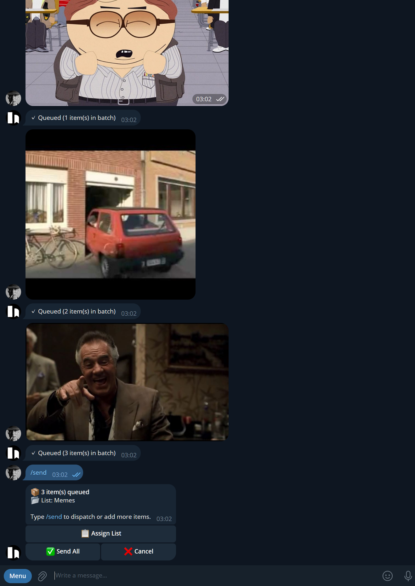
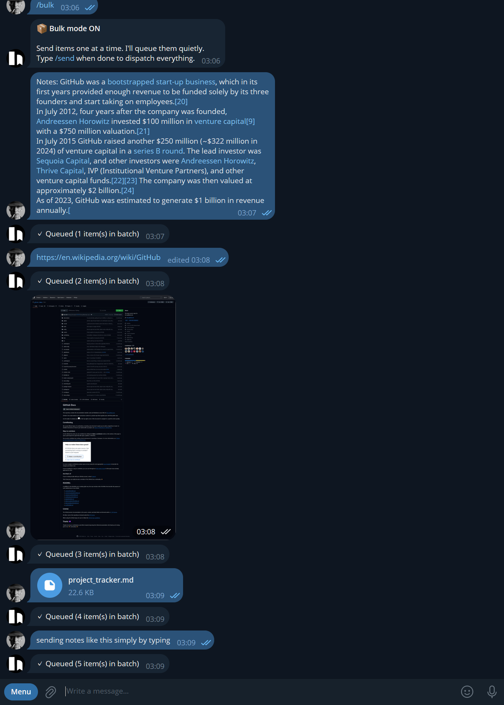

<a href="https://www.buymeacoffee.com/acd96" target="_blank"></a>

# KaraTel Bot

A self-hosted Telegram bot for [Karakeep](https://github.com/karakeep-app/karakeep) — the open-source bookmark manager.

Send links, images, PDFs, notes, and markdown files from Telegram and get an interactive popup to assign a list, edit metadata, and confirm before anything hits your Karakeep. Supports bulk mode for batching multiple items and dispatching them all at once.

Built for personal use on a home server. Docker deployment alongside your existing Karakeep stack.

---

## Why this exists

Karakeep's native Telegram integration is fire-and-forget — paste a link, it saves. No list assignment, no metadata control, no bulk mode, no file support.

This bot adds an interactive layer on top of the Karakeep API:

- See what you're saving before you save it
- Assign a list with one tap
- Edit the title before it lands
- Queue up a batch and dispatch it all at once
- Send images, PDFs, and `.md` files — not just links

Inspired by [karakeepbot](https://github.com/Madh93/karakeepbot) (Go, much simpler). This is an independent Python project with a different scope.

---

## Screenshots

**Bulk mode** — queue any mix of images, links, notes, and files, then dispatch with `/send`:





**List picker** — your full Karakeep list hierarchy, sub-lists included:


---

## Features

**Normal mode** — send one item at a time, get a popup for each:

```
🔗 reddit.com
📌 Self-hosted tools worth knowing in 2026
💬 A curated list of projects that run...

  [📋 Pick List]  [✏️ Edit]
  [✅ Send]        [❌ Cancel]
```

**Bulk mode** — queue items silently, assign a list to the whole batch, send everything at once with `/send`.

**Content types supported:**

| What you send | How it saves |
|---|---|
| URL | Karakeep `link` bookmark with enriched metadata |
| Photo | Uploaded as image asset |
| PDF | Uploaded as PDF asset |
| `.md` file | Saved as Karakeep text note (content preserved) |
| Plain text | Saved as Karakeep note |

**Metadata enrichment** (optional, on by default):

The bot fetches its own metadata before showing the popup, independently of Karakeep's crawler. This matters most for:

| Domain | Method |
|---|---|
| Reddit | `old.reddit.com` JSON API — works where Karakeep's Playwright crawler fails |
| YouTube | oEmbed API — title, channel, thumbnail |
| PubMed | NCBI E-utilities — title, authors, abstract |
| Everything else | OG tags (`og:title`, `og:description`, `og:image`) |

Turn enrichment off with `METADATA_ENRICHMENT=false` if you'd rather let Karakeep handle everything.

**Multi-user** — each Telegram user links their own Karakeep API key. Access is restricted to an allowlist of Telegram user IDs.

---

## Requirements

- A running [Karakeep](https://github.com/karakeep-app/karakeep) instance (tested on v0.32.0)
- Docker (bot runs as a container alongside Karakeep)
- A Telegram bot token from [@BotFather](https://t.me/BotFather)
- Your numeric Telegram user ID (DM [@userinfobot](https://t.me/userinfobot))

---

## Setup

See **[DEPLOY.md](DEPLOY.md)** for the full step-by-step guide.

The short version:

1. Clone this repo to your server
2. Add a `karabot` service to your Karakeep `docker-compose.yml`
3. Create `.env.bot` with your bot token, Telegram user ID, and Karakeep URLs
4. `docker compose build karabot && docker compose up -d karabot`
5. Open Telegram, DM your bot, type `/setapi` and paste your Karakeep API key

---

## Configuration

Copy `.env.example` to `.env.bot` and fill in your values:

```env
TELEGRAM_BOT_TOKEN=          # From @BotFather
TELEGRAM_ALLOWED_USER_IDS=   # Your numeric Telegram ID (comma-separated for multiple users)
KARAKEEP_INTERNAL_URL=       # How the bot reaches Karakeep inside Docker (e.g. http://web:3001)
KARAKEEP_EXTERNAL_URL=       # Your LAN/public URL for clickable links (e.g. http://192.168.1.x:3001)
BOT_DATABASE_PATH=           # Leave as /data/karabot.db
METADATA_ENRICHMENT=true     # Set to false to skip enrichment and let Karakeep handle metadata
```

---

## Commands

| Command | Description |
|---|---|
| `/start` | Usage guide |
| `/setapi` | Link or update your Karakeep API key |
| `/bulk` | Enter bulk mode |
| `/normal` | Return to normal mode and clear the queue |
| `/send` | Dispatch bulk queue (bulk mode only) |

---

## Stack

- Python 3.12
- [python-telegram-bot](https://github.com/python-telegram-bot/python-telegram-bot) v21 (async)
- [httpx](https://www.python-httpx.org/) — async HTTP
- [BeautifulSoup4](https://www.crummy.com/software/BeautifulSoup/) + lxml — OG tag scraping
- [aiosqlite](https://github.com/omnilib/aiosqlite) — async SQLite (user keys, session state, bulk queue)

---

## License

MIT — do whatever you want with it.

---

Made by [ACD96dev](https://github.com/ACD96dev) · [Buy Me a Coffee](https://buymeacoffee.com/acd96)

Claude was used partially in troubleshooting.
